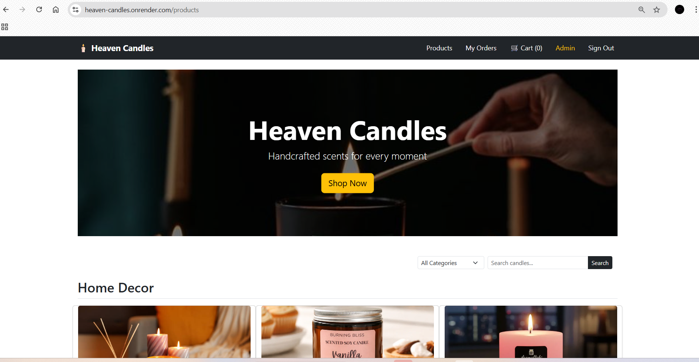
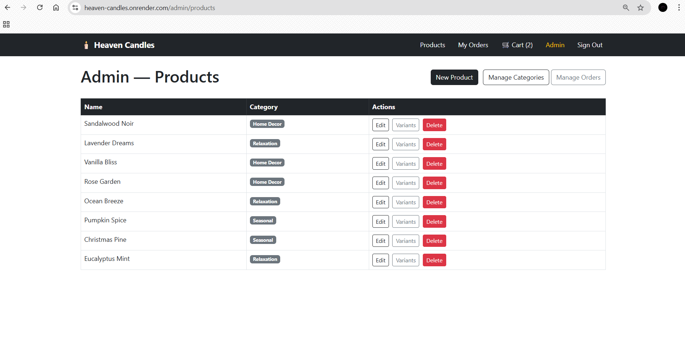
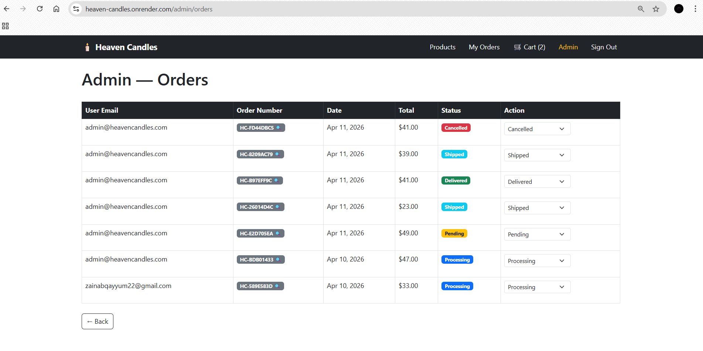
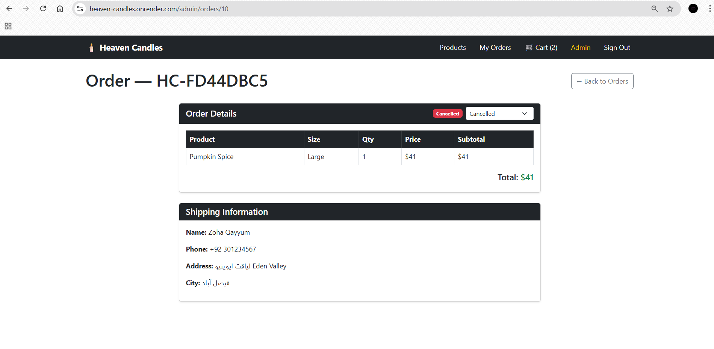
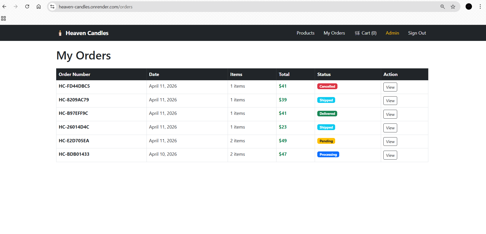
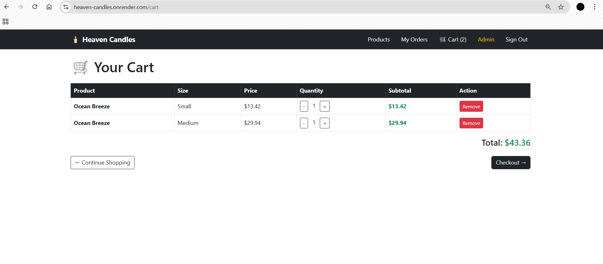
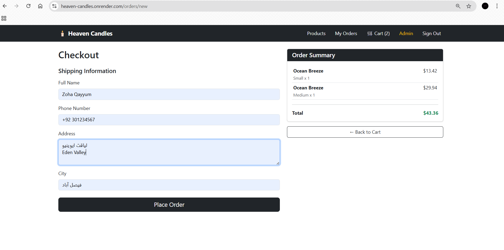

# Heaven Candles 🕯️

A full-featured e-commerce web application built with Ruby on Rails, featuring product management, shopping cart, order checkout, coupon system, product reviews, and an admin panel.

## 🌐 Live Demo
**[https://heaven-candles.onrender.com](https://heaven-candles.onrender.com)**

> **Note:** Hosted on Render free tier. First load after inactivity may take 30-60 seconds.

**Demo Credentials:**
- Admin: `admin@heavencandles.com` / `password123`
- Customer: `user@heavencandles.com` / `password123`

## 📸 Screenshots

### Products Page


### Admin Products Page


### Admin Orders


### Admin Order Detail


### My Orders (customer) 


### My Cart 


### Checkout page 


## ✨ Features

### 🛍️ Product Catalog
- Product catalog with categories and variants (size/price)
- Dynamic size selector with Stimulus.js — updates price and cart form without page reload
- Full-text product search using pg_search (prefix + trigram matching)
- Filter products by category with auto-submit
- Related products on show page (same category, limit 3)
- Pagination with Kaminari
- Image uploads with Active Storage + Cloudinary

### 🛒 Cart & Checkout
- Database-backed cart with CartItem model — persists across sessions
- Guest cart via session_id for non-logged-in users
- Quantity selector with stock validation
- Out of stock UI — Add to Cart disabled per variant
- Order checkout with shipping details
- Order management with ActiveRecord transactions for data consistency
- Stock decrement on order placement

### 🎟️ Coupon System
- Coupon code system with Stimulus-powered UI
- Percentage and fixed amount discounts
- Expiry date validation
- Per-user usage tracking to prevent abuse
- Admin coupon management panel

### ⭐ Product Reviews
- Star ratings with Font Awesome half-star display
- Guest submissions (name + email, no account required)
- Admin approval workflow — reviews pending until approved
- Average rating display on product cards and show page
- All reviews index page with pagination per product

### 📦 Order Management
- Order history with status tracking for users
- Guest order tracking by order number
- Order status transitions with business rule validation (pending → processing → shipped → delivered)
- Admin order management — filter by status, search by order number

### 📧 Email Notifications
Uses Action Mailer with Sidekiq background jobs and Gmail SMTP for:
- Welcome email on signup
- Order confirmation with coupon discount breakdown
- Status update when admin changes order status

### 🔐 Authentication
- User authentication (sign up, login, logout) with Devise
- Admin panel with role-based access control

### 🎨 UI & UX
- Responsive UI with Bootstrap 5
- Sticky admin sidebar
- Full-width banner
- Footer
- Truncated product descriptions on cards

## 🛠️ Tech Stack
- **Framework:** Ruby on Rails 7.1
- **Language:** Ruby 3.2.2
- **Database:** PostgreSQL
- **Search:** pg_search (full-text + trigram)
- **Authentication:** Devise
- **Background Jobs:** Sidekiq + Redis
- **Image Storage:** Active Storage + Cloudinary
- **Frontend:** Hotwire (Turbo + Stimulus)
- **Styling:** Bootstrap 5 + Font Awesome
- **Pagination:** Kaminari
- **Deployment:** Render.com

## ⚙️ Local Setup
```bash
# Clone the repo
git clone https://github.com/zohaQayyum/heaven_candles.git
cd heaven_candles

# Install dependencies
bundle install

# Setup database
rails db:create
rails db:migrate
rails db:seed

# Set environment variables
# Create .env file with:
# CLOUDINARY_CLOUD_NAME=your_cloud_name
# CLOUDINARY_API_KEY=your_api_key
# CLOUDINARY_API_SECRET=your_api_secret

# Start Sidekiq (in a separate terminal)
bundle exec sidekiq

# Start server
rails server
```

## 📝 Technical Notes

### Shopping Cart
Database-backed cart using `carts` and `cart_items` tables, providing persistence across devices and sessions. Guest users are tracked via `session_id` — their cart merges with their account on login.

### Image Uploads
Uses Active Storage with Cloudinary as the storage backend, ensuring images persist across deployments and are served via CDN globally.

### Order Status
Implements state machine-style transition validation — invalid status jumps (e.g. pending → delivered) are rejected at the model level.

### Search
Uses PostgreSQL's full-text search via pg_search gem with prefix and trigram matching, allowing partial word searches across product names and descriptions.

### Background Jobs
Sidekiq with Redis processes all email notifications asynchronously, keeping request response times fast and ensuring email delivery even under load.

### Coupon System
Coupons support both percentage and fixed discounts with expiry dates. Per-user usage tracking prevents the same user from applying a coupon multiple times.
